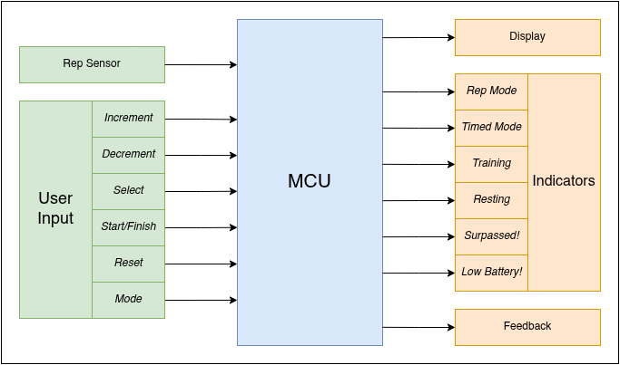
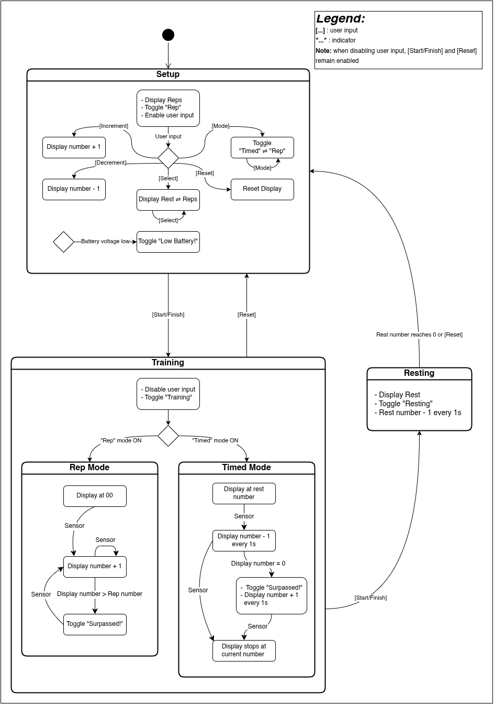
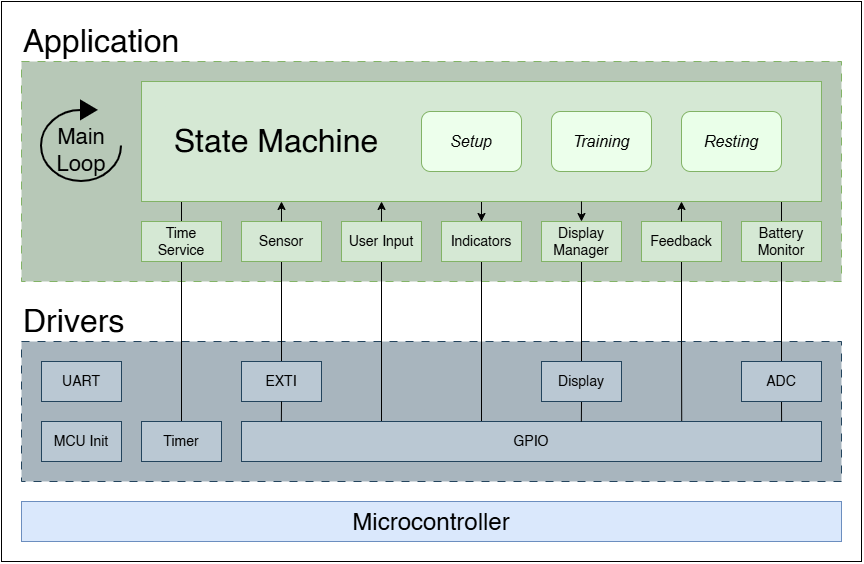

# ARM Flex
# 1. Project Overview & Goals
This project's intent is to design and develop a **Training Assistant embedded system**, serving as a personal training tool and a platform to practice embedded systems design and development.
# 2. System Capabilities
As for the first version, this system will be capable of:
- allowing the user to set repetitions (reps for short) and rest time
- switching to different rep modes (count based and time based)
- sensing and counting reps as well as displaying them
- indicate a threshold surpassed state for reps
- switching to rest mode when pressing a button

# 3. System Requirements
The criteria required for the approval of this project will be:
- Rep detection accuracy ≥ 99% (≤ 1 missed or false count per 100 reps)
- System shall correctly detect repetition pulses up to **5 Hz** without missed events
- Timer accuracy ≤ **±1%** over full workout duration
- Display refresh rate ≥ **100 Hz** (no visible flicker)
- System startup time ≤ **300 ms**
- Continuous operation time ≥ **2 hours** on battery
- System shall issue **low-battery warning** before unsafe shutdown
- System shall reject sensor noise and prevent false triggers
- System shall operate reliably during normal human motion without resets or freezes
- System shall run continuously for ≥ **8 hours** (soak test) without crash or memory corruption

# 4. System Constraints
The project must comply with the following constraints:
### A — Compute & Memory
- Must operate within the limits of a low-resource microcontroller (limited RAM, Flash, and CPU)
- Processing must leave headroom for real-time sensing and display updates
- Only on-chip peripherals may be used (no external coprocessors)
### B — Power & Energy
- Battery-powered operation
- Must tolerate battery voltage variation across discharge range
### C — Cost
- Low-cost, hobbyist-accessible components only
- No specialized or hard-to-source parts
### D — Physical & Environmental
- Compact and portable form factor
- Intended for normal indoor human use only (no harsh/high-temperature environments)

# 5. System Structure & Behavioral Model
### Block Diagram

### State Machine

*note:* Internal boxes represent actions triggered by events; they are not standalone states.

# 6. Software Architecture & Module Responsibilities
The software architecture is designed to be minimal and capability-driven, avoiding unnecessary abstraction layers and unused drivers. Therefore, it will be based on this hardware specifications below:
- Rep sensor presents information via digital pulse (to simplify hardware and meet constraints)
- Time is obtained via hardware timer
- Display is driven via GPIO multiplexing and managed using a separate module for simplicity
- Battery monitoring via ADC
### Software Architecture

### Module Responsibilities
#### A - Drivers
- MCU Init
	- Initializes microcontroller core, clock system, and power management
	- Enables required peripherals and interrupts
	- Executes once on startup
- Timer
	- Configures and controls hardware timer peripherals
	- Provides timer ticks / compare events via ISR
	- Exposes a generic time base to higher layers
- GPIO
	- Configures digital input/output pins
	- Provides pin read/write access
	- Owns GPIO interrupt configuration if used
- Display
	- Manages low-level display operations
	- Handles multiplexing, refresh, and clearing
	- Exposes primitive drawing / update functions
- ADC
	- Configures ADC peripheral and channels
	- Manages calibration and reference voltage
	- Performs raw analog-to-digital conversions
- UART
	- Initializes and configures the USART peripheral (baud rate, transmitter/receiver, GPIO alternate functions)
	- Provides functions for transmitting and receiving serial data
	- Supports firmware debugging and diagnostics through serial communication
#### B - Application Layer
- State Machine (FSM)
	- Acts as the central decision-making logic
	- Owns system states (Setup, Training, Resting)
	- Manages state transitions based on events
	- Coordinates activation/deactivation of application services
- Time Service
	- Provides software timers built on the Timer driver
	- Manages:
		- Rest countdown timing (1 s resolution)
		- Timed-mode training duration tracking
- Sensor
	- Monitors repetition sensor input during training
	- Filters and validates sensor readings
    - Generates events for the FSM
- User Input
	- Scans and debounces user input controls
	- Detects short/long presses and combinations
	- Maps physical inputs to semantic events:
	    - Increment, Decrement, Select, Start/Finish, Reset, Mode
- Indicators
	- Configures and controls indicators
	- Maps them to semantic events:
		- Rep mode, Timed mode, Training, Resting, Surpassed!, Low Battery!
- Display Manager
	- Determines what information to display based on FSM state
	- Formats reps, time, and status messages
	- Uses the Display driver for rendering
- Feedback
	- Configures different types of feedback
- Battery Monitor
	- Periodically samples battery voltage via ADC driver
	- Detects if battery is low and triggers "Low Battery!" event for FSM

# 7. Timing and Scheduling Model
To ensure deterministic behavior and reliable real-time operation, the firmware follows a simple periodic time-base combined with a cooperative superloop architecture.  
Time-critical activities are handled inside short interrupt routines, while all processing and decision logic executes in the main loop.
This model is implemented through the Timer and Time Service modules of the software architecture.
### System Tick: 
Based on the functional requirements (display multiplexing, button response, and a maximum repetition rate of 5 Hz), a global time base of **1 ms** provides sufficient timing resolution and large safety margins.
A hardware timer generates an interrupt every **1 ms**, which serves as the system-wide reference clock for all software timers and periodic tasks.
### Interrupt Service Routine (ISR)
Only operations that require precise timing or immediate event capture are executed in the ISR.
ISR responsibilities:
- Increment global tick counter
- Update display multiplex (activate next digit)
- Capture repetition sensor edge and set event flag
### Main Loop (Superloop)
All non-critical processing executes cooperatively in the main loop, including:
- Finite State Machine updates
- Button scanning and debouncing
- Rep counting and validation
- Countdown/rest timers (using the tick counter)
- Display value preparation/formatting
- Battery voltage sampling (ADC)
- Indicators and Feedback control

# 8. Hardware Decisions
### Microcontroller

**STM32F103C8T6 “Blue Pill”**  

Selected for its cost-effective performance, sufficient GPIO and ADC channels, and broad community and ST support. The Cortex-M3 core provides higher performance, enabling efficient handling of current tasks while offering room for future enhancements and more advanced projects. Additionally, learning STM32 builds ARM expertise directly relevant to modern embedded systems, making it an essential skill for my career.
### Power and Battery

**Rechargeable Li-Ion 18650 with charger IC**  

Chosen for availability and sufficient energy density. Provides a regulated rail suitable for MCU operation. Primary tradeoff is careful handling of the Li-Ion cell to prevent overcharge, overdischarge, or short circuits, which must be mitigated through proper charging and protection design.
### Sensor

**Hall-effect sensor module (KY-024)**  

Provides both analog and digital outputs, enabling flexibility for current and future firmware revisions. Its simplicity and modular form reduce integration effort. Tradeoff lies in mechanical placement and signal interpretation, which must be carefully addressed to reliably detect and count repetitions.
### Display

**4-digit common-cathode multiplexed 7-segment display**  

Offers a compact, power-efficient output solution with low I/O usage. Multiplexing introduces timing constraints but remains well within MCU capabilities and is preferable to discrete 7-segment implementations.
### User Input and Indicators

**Push buttons and LEDs**  

Chosen for simplicity, reliability, and minimal hardware and firmware overhead. No significant tradeoffs identified at this stage.
### Feedback

**Active buzzer** 

Easy to drive and effective for user notifications. Potential drawback is limited control over volume and tone, making it a candidate for refinement in later revisions.
# 9. Verification Strategy
The strategy for verifying the functionality and performance of the system is performed gradually from low-level drivers to full-system behavior
### 1) Driver-level
**Goal:** Each peripheral operates correctly in isolation  
**Procedures:**
- Dedicated test firmware per driver
- UART logs for status and values
- Logic analyzer for timing-critical signals (timer tick, display multiplex)

**Pass criteria:**  Correct functionality and stable operation for ≥ 2 minutes
### 2) Module-Integration
**Goal:** Drivers and application modules interact reliably  
**Procedures:**
- Execute functional chains (sensor → processing → display)
- Stress inputs and worst-case loads

**Pass criteria:** No missed events, freezes, or visible artifacts
### 3) System Tests
**Goal:** Meets the system requirements set in section 3  
**Procedures:**
- Full operational scenarios
- Long continuous run
- Reset and startup test

**Pass criteria:** Correct outputs, stable behavior, no unintended resets
### 4) Power Monitoring
**Goal:** Supply remains stable under all operating conditions  
**Procedures:**
- Measure idle and active current
- Measure rail voltage under load
- Inspect ripple/brownout with oscilloscope when available

**Pass criteria:** Voltage within limits, no brownout or instability
# 10. Version Strategy
I will be using this version format: v**X.Y** where:
- **X** is the baseline version concerning major changes
- **Y** is the update version concerning minor fixes and additions
